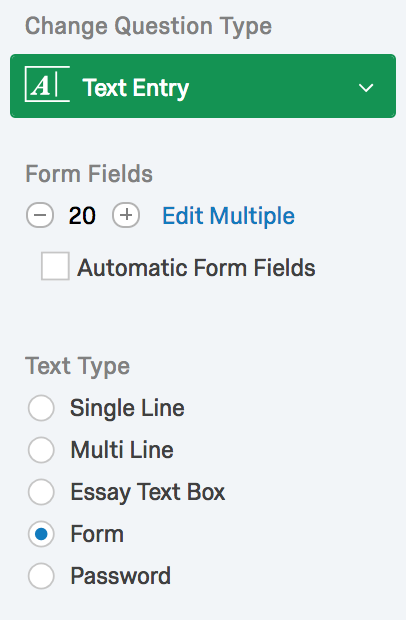

Qualtrics Expanding Autocomplete
====

Eliciting lists of entries is something that comes up in my survey work fairly often. Presenting a long list of empty form fields is both ugly and intimidating. This custom question utilizes [jQuery](https://jquery.com/) and [Twitter's Typeahead](https://twitter.github.io/typeahead.js/) to turn a Form type Text Entry question. Additionally, the text entries attempt to suggest entries loaded via Ajax. This functionality attempts to address the problem of open entry text by suggesting normalized data.

An demo of this question type is available at https://ucdavis.co1.qualtrics.com/jfe/form/SV_6WjXppDW1cdbMjz

As is, this code works on Form type Text Entry questions of any length.

